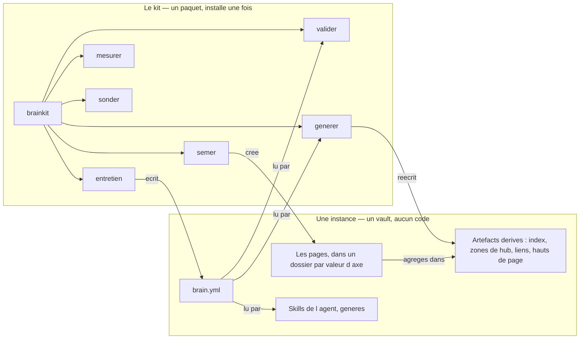

# BrainKit

**Le noyau générique d'un second brain : un vault Obsidian de fichiers markdown
qui se valide, se génère et se propage tout seul — sur n'importe quel sujet.**


Tout ce qui est propre à un sujet vit dans un seul fichier, `brain.yml` ; rien
dans le code ne nomme un domaine. Le kit a été **extrait** d'un brain de
développement logiciel de 765 pages, puis éprouvé sur trois autres sujets —
l'histoire, la montagne, le droit du travail — pour vérifier qu'il n'en avait
rien gardé.

---

## Sommaire

- [Architecture](#architecture)
- [Démarrage](#démarrage)
- [Documentation](#documentation)
- [Ce qu'il fait](#ce-quil-fait)
- [Ce qui tient l'ensemble](#ce-qui-tient-lensemble)
- [Tests](#tests)
- [Structure du projet](#structure-du-projet)
- [Licences et composants](#licences-et-composants)

---

## Architecture

Le kit est un **paquet Python**, pas un dépôt-gabarit qu'on clone puis qu'on
vide. Une instance ne contient donc **pas de code** : elle porte son manifeste,
ses pages et ses artefacts dérivés, et elle appelle le kit qui vit ailleurs.
C'est ce qui fait qu'une correction du validateur atteint toutes les instances
le jour où elle est faite.



Le détail — les huit paquets, les deux modes, les deux profils — est dans
[docs/02-architecture.md](docs/02-architecture.md).

---

## Démarrage

**La voie normale est un agent de code** — Claude Code, Cursor, Antigravity,
Windsurf ou un autre : on lui donne les consignes, il pose les questions et il
suit les recettes. Il n'y a **aucune clé d'API à fournir**, nulle part. Le point
d'entrée d'un agent est [AGENTS.md](AGENTS.md), et les recettes sont dans
[recettes/](recettes/README.md).

Tout le kit s'utilise aussi à la main, dans un terminal — c'est ce que fait la
suite de cette section. Pré-requis : `git`, Python 3.10+,
[`uv`](https://docs.astral.sh/uv/). Obsidian est facultatif.

```bash
git clone <url du dépôt BrainKit> ~/BrainKit
cd ~/BrainKit
git config core.hooksPath .githooks      # les trois garde-fous d identite
uv run brainkit                          # doit lister les huit sous-commandes
```

Puis créer un premier brain :

```bash
uv tool install --editable ~/BrainKit                  # brainkit sur le PATH
brainkit entretien --questions                         # les 49 questions
brainkit entretien --brouillon mon.entretien.yml       # y repondre, une a la fois
brainkit entretien --brouillon mon.entretien.yml --composer mon.brain.yml
brainkit semer --manifeste mon.brain.yml --dans ~/MonBrain --ecrire
cd ~/MonBrain && brainkit valider                      # 0 violation dure
brainkit generer                                       # --check : les derives concordent
```

**Le mode par défaut n'écrit jamais.** `semer` sans `--ecrire` dit ce qu'il
ferait, fichier par fichier ; `generer` sans `--ecrire` contrôle et sort en 2 sur
écart. Il n'y a pas d'URL de clone si le dépôt vous est arrivé par copie ou par
`git bundle` : les trois formes sont couvertes par
[docs/03-installation.md](docs/03-installation.md) §2.

---

## Documentation

Le dépôt porte **deux** natures de documentation, et c'est la première chose à
savoir :

| Nature | Où | Comment on la corrige |
|---|---|---|
| **la doc du kit** | [`docs/`](docs) — écrite à la main | on l'édite |
| **la doc d'une instance** | à la racine du vault semé — **générée** depuis `brain.yml` | on corrige le générateur ou le manifeste, jamais le fichier |

| Vous voulez | Lisez |
|---|---|
| piloter le kit avec un agent de code | [AGENTS.md](AGENTS.md), puis [recettes/](recettes/README.md) |
| installer le kit | [docs/03-installation.md](docs/03-installation.md) |
| créer votre premier brain | [docs/05-premier-brain.md](docs/05-premier-brain.md) |
| régler Obsidian, avec les captures | [docs/04-obsidian.md](docs/04-obsidian.md) |
| l'usage de tous les jours | [docs/06-manuel.md](docs/06-manuel.md) |
| pourquoi c'est fait comme ça | [docs/01-cadrage.md](docs/01-cadrage.md) |
| remettre un brain sans accès internet | [docs/07-livrer-une-instance.md](docs/07-livrer-une-instance.md) |
| un problème | [docs/08-depannage.md](docs/08-depannage.md) |
| les secrets et l'identité git | [docs/SECURITY.md](docs/SECURITY.md) |

L'index complet est dans [docs/README.md](docs/README.md). Un exemple des
documents qu'une instance porte est dans
[`gabarit/rendu/`](gabarit/rendu). L'état du chantier —
ce que le kit fait, ce qu'il ne fait pas, ce qui reste ouvert — est dans
[design/etat-final.md](design/etat-final.md).

---

## Ce qu'il fait

| Commande | Ce qu'elle fait |
|---|---|
| `entretien` | mène les 49 questions qui produisent un `brain.yml`, et **refuse d'en deviner treize** |
| `semer` | crée le vault : dossiers, hubs, gabarits, taxonomie, skills, hooks, dépôt et premier commit |
| `valider` | dix règles de contenu et de structure, chacune avec la sévérité **que le manifeste déclare** |
| `generer` | les artefacts dérivés — index, zones de hub, carte des liens, hauts de page. `--check` par défaut |
| `mesurer` | ce qu'une règle **coûterait** avant de la durcir, et les garde-fous qui l'interdisent trop tôt |
| `sonder` | l'**amont** d'une unité quand elle en a un : dernière version publiée, dernier commit, dépôt archivé. Sans jeton, et n'écrit que dans un side-car |
| `re-seuiller` | change le seuil de promotion d'un sous-dossier — une **migration**, par `git mv` |
| `freeze` | copie le kit **dans** l'instance et coupe la dépendance, pour une remise hors ligne |

---

## Ce qui tient l'ensemble

- **Une seule source.** La taxonomie, les gabarits, les guides, les skills, la
  table de propagation, la table de couleurs : tous **générés** depuis
  `brain.yml`. Deux sources qui décrivent la même chose divergent — c'est
  mesuré, pas supposé : dans le vault d'origine, le dossier des gabarits avait
  pris **trois lots de retard** sur ses 337 pages.
- **Aucune sévérité n'est héritée.** Un brain neuf reçoit ses dix règles en
  `a_mesurer`. On ne durcit qu'après avoir compté ; on n'assouplit qu'en
  écrivant le motif. `brainkit mesurer` est l'outil de ce comptage, et il refuse
  de proposer un durcissement sous **30 pages**.
- **Rien ne se devine.** Ni un axe, ni une sévérité, ni une identité git, ni un
  chemin de kit. Un champ vide est une question ouverte ; une valeur inventée
  est une faute.
- **Ce qui est généré n'est jamais édité à la main**, et ça se vérifie : chaque
  générateur a un `--check` qui sort en 2 s'il reste un écart.

Et la phrase qui les résume, née d'une règle dure sur les hauts de page :
**une fiche vide honnêtement vaut mieux qu'une fiche remplie au jugé.**

---

## Tests

Dix jeux d'épreuve, tous lançables par `uv run`, aucun ne demande de service
extérieur.

```bash
uv run schema/valider.py        # le contrat du manifeste
uv run outils/fidelite.py --vault <un vault reel>   # la fidelite manifeste/vault
uv run outils/emballer.py       # les documents generes du depot sont-ils a jour
uv run outils/captures.py       # les images referencees existent, aucune n est orpheline
bash  outils/neutralite.sh      # aucun sujet nomme dans un fichier livre
uv run tests/epreuve.py         # la validation
uv run tests/generation.py      # les generateurs
uv run tests/semis.py           # le semis, re-seuiller, freeze
uv run tests/skills.py          # les skills, et leur genericite
uv run tests/mesure.py          # la mesure et ses garde-fous
uv run tests/amont.py           # la fraicheur
uv run tests/entretien.py       # les 49 questions, les 13 refus
uv run tests/emballage.py       # les documents, les profils, les ponts, le figeage
```

Deux d'entre eux lisent un vault **réel** s'il est là, et le sautent sinon. Ce
que chacun établit est détaillé dans
[docs/02-architecture.md](docs/02-architecture.md) §9.

---

## Structure du projet

```text
brainkit/            le kit — 8 paquets, 76 modules, ~18 900 lignes
  valider/             les dix regles, et les controles de socle declares
  generer/             les quatre artefacts derives
  semer/               semer, re-seuiller, freeze — un plan d ecriture unique
  entretien/           49 questions, 11 passes, 13 refus de deviner
  mesurer/             ce qu une regle couterait, et trois garde-fous
  skills/              les trois skills de l agent, generes
  emballer/            les documents D UNE INSTANCE, generes, et le manifeste d images
  amont/               la fraicheur : sonder, dater, signaler
schema/              le contrat de brain.yml, en JSON Schema, et son validateur
gabarit/             LE MANIFESTE DE REFERENCE — tous les mecanismes, aucun sujet
  rendu/               les documents d une instance, rendus une fois pour lecture
tests/               les dix jeux d epreuve
outils/              les outils de developpement du kit
recettes/            LES RECETTES — une par tache, markdown pur, tout agent
skills/              des enveloppes minces pour Claude Code, qui pointent vers recettes/
AGENTS.md            ce que ce depot est, pour un agent de code
design/              le cadrage, les onze rapports de lot, l etat final, le protocole de captures
docs/                LA DOCUMENTATION DU KIT — ecrite a la main
  img/                 les captures d ecran
.githooks/           trois hooks d identite et de message
```

---

## Licences et composants

| Composant | Rôle | Licence |
|---|---|---|
| Python (≥ 3.10) | le langage du kit | PSF License |
| PyYAML (≥ 6) | lecture et écriture du manifeste — **la seule dépendance d'exécution** | MIT |
| jsonschema (≥ 4) | rejoue le contrat du manifeste ; extra `epreuve` seulement | MIT |
| hatchling (≥ 1.24) | construction du paquet | MIT |
| `uv` | lanceur et installateur de paquets | MIT / Apache-2.0 |
| Obsidian | lecteur du vault, en profil `obsidian` | propriétaire, gratuit pour un usage personnel |
| Local REST API with MCP | pont entre le vault vivant et un agent | MIT |
| Templater | résout le jeton des gabarits générés | AGPL-3.0 |
| File Hider | masque un dossier de la barre latérale | MIT |
| Dataview | requêtes en ligne, repli des vues natives | MIT |
| **BrainKit** | ce dépôt | **tous droits réservés** — voir [LICENSE](LICENSE) |

Le kit n'embarque **aucun** plugin Obsidian : il les nomme, l'utilisateur les
installe depuis le catalogue.

**Tous droits réservés** est un choix **réversible** et **non tranché** : c'est
le seul état depuis lequel on peut aller vers n'importe quelle licence, et
l'inverse est faux. Le point est ouvert dans
[design/00-cadrage.md](design/00-cadrage.md) §5.7.
