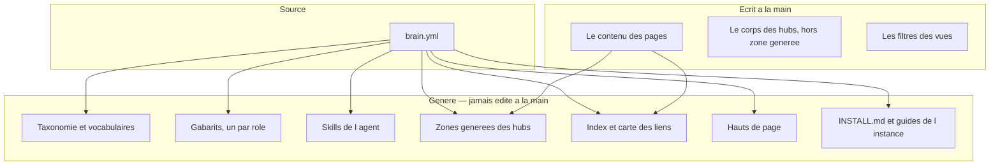
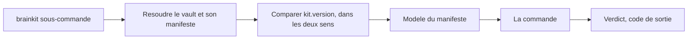

# Architecture — comment le kit est construit

**Ce document dit le COMMENT.** Le POURQUOI est dans
[01-cadrage.md](01-cadrage.md).

---

## Sommaire

1. [La distinction qui commande tout : kit et instance](#1-la-distinction-qui-commande-tout--kit-et-instance)
2. [Le manifeste, seule source](#2-le-manifeste-seule-source)
3. [Les huit paquets](#3-les-huit-paquets)
4. [Le flux d'une commande](#4-le-flux-dune-commande)
5. [Les deux natures de documentation](#5-les-deux-natures-de-documentation)
6. [Les deux modes d'une instance](#6-les-deux-modes-dune-instance)
7. [Les deux profils d'un brain](#7-les-deux-profils-dun-brain)
8. [Structure du dépôt](#8-structure-du-dépôt)
9. [Le jeu d'épreuve](#9-le-jeu-dépreuve)
10. [Licences et composants](#10-licences-et-composants)

---

## 1. La distinction qui commande tout : kit et instance

Le kit est un **paquet Python**. Ce n'est pas un dépôt-gabarit qu'on clone puis
qu'on vide.

> **Problème** : comment livrer une correction du validateur à des vaults déjà
> créés ? **Options** : (a) un dépôt-gabarit que chaque brain clone, (b) un
> paquet installé une fois, que les instances appellent. **Retenu** : (b),
> **plutôt que** (a) **parce qu'**un gabarit cloné fourche le jour du clone :
> une correction n'atteint jamais les copies déjà faites. **Limite** : une
> instance ne sait pas *où* le kit vit — c'est un trou réel, et il a deux
> bouchons nommés au chapitre [03-installation.md](03-installation.md) §4.

Conséquence directe : **une instance ne contient pas de code**. Elle contient
son manifeste, ses pages, ses artefacts dérivés et une couche de ponts. Le seul
cas où du code entre dans une instance est le figeage, voir §6.

---

## 2. Le manifeste, seule source

`brain.yml`, à la racine de l'instance. Tout ce qui décrit la **forme** du brain
en sort, et rien de ce qui en sort ne s'écrit à la main.



Le schéma se lit dans les deux sens : le manifeste décide de la **forme**, les
pages alimentent les **agrégats**. Un filtre de vue n'est ni l'un ni l'autre —
c'est un arbitrage éditorial, et le kit ne le génère pas.

Le contrat du manifeste est un **JSON Schema**, dans
[`../schema/brain.schema.json`](../schema/brain.schema.json), doublé de dix
contraintes de cohérence que le schéma seul ne peut pas exprimer
([`../schema/valider.py`](../schema/valider.py)).

---

## 3. Les huit paquets

**76 modules, environ 18 900 lignes.** Un paquet par verbe, et la frontière est
toujours la même question : *à qui ce module parle-t-il ?*

| Paquet | Modules | Lignes | Ce qu'il fait |
|---|---|---|---|
| [`brainkit/valider/`](../brainkit/valider) | 13 | ~3 050 | les dix règles de contenu et de structure, plus les contrôles de socle que le manifeste déclare, chacun avec **sa** sévérité |
| [`brainkit/generer/`](../brainkit/generer) | 11 | ~1 900 | les quatre artefacts dérivés — index, zones de hub, carte des liens, hauts de page |
| [`brainkit/semer/`](../brainkit/semer) | 14 | ~3 675 | crée le vault, et porte le **plan d'écriture unique** que `re-seuiller` et `freeze` partagent |
| [`brainkit/entretien/`](../brainkit/entretien) | 8 | ~3 255 | les 49 questions en 11 passes, les 13 refus de deviner, la composition du manifeste |
| [`brainkit/mesurer/`](../brainkit/mesurer) | 8 | ~1 350 | ce qu'une règle **coûterait**, et les trois garde-fous qui interdisent de durcir trop tôt |
| [`brainkit/skills/`](../brainkit/skills) | 7 | ~2 465 | les trois skills de l'agent, générés depuis le manifeste |
| [`brainkit/emballer/`](../brainkit/emballer) | 4 | ~1 940 | les documents **d'une instance** — son `INSTALL.md` et ses trois guides — plus le manifeste d'images |
| [`brainkit/amont/`](../brainkit/amont) | 7 | ~935 | la fraîcheur : sonder l'amont d'une unité, dater, signaler |

Plus quatre modules à la racine du paquet :
[`__main__.py`](../brainkit/__main__.py) (la porte d'entrée unique),
[`contrat.py`](../brainkit/contrat.py) (la comparaison de version, dans les deux
sens), [`defauts.py`](../brainkit/defauts.py) et
[`__init__.py`](../brainkit/__init__.py), qui porte **la** version du kit — lue
par `pyproject.toml`, jamais recopiée.

### Pourquoi trois commandes partagent un module

`semer`, `re-seuiller` et `freeze` vivent toutes dans `brainkit/semer/`. Ce
n'est pas un fourre-tout : elles partagent le **plan d'écriture**, donc ses
quatre refus. Un module par commande aurait dupliqué ces garde-fous, et une
commande qui les oublierait écrirait quelque part.

### Pourquoi les documents du dépôt du kit ne sont pas dans `emballer/`

`brainkit/emballer/` génère les documents d'une **instance**, depuis **son**
manifeste. La documentation que vous lisez décrit le **kit** : elle ne dépend
d'aucun manifeste, elle est donc écrite à la main. Voir §5.

---

## 4. Le flux d'une commande

Toutes les commandes passent par la même porte, et aucune ne choisit de défaut.



Deux points de ce flux méritent d'être connus, parce qu'ils produisent des
messages qu'on rencontre vite :

- **la résolution.** Une commande lancée dans un vault résout `./brain.yml`, et
  jamais un manifeste voisin. Passer `--manifeste` sur un vault qui porte le
  sien fait imprimer un avertissement **avant** le verdict : les violations qui
  suivraient n'auraient aucun sens.
- **la version.** `kit.version` du manifeste est comparée à celle du kit
  installé, **dans les deux sens**. Un kit ancien ignorerait en silence des
  déclarations qu'il ne sait pas lire ; il refuse plutôt de tourner.

Sans sous-commande, `brainkit` liste ce qu'il sait faire et **sort en 2**. Il
ne devine pas : `valider` ne lit rien, `generer` peut écrire, `semer` crée un
vault.

---

## 5. Les deux natures de documentation

C'est une frontière de dépôt, et elle est la raison de la forme de ce dossier.

| Nature | Qui l'écrit | Où elle vit | Ce qu'elle nomme |
|---|---|---|---|
| **la doc du kit** | écrite à la main | `docs/` — ce dossier | des commandes, des mécanismes, l'interface d'Obsidian. Aucun sujet, aucun manifeste |
| **la doc d'une instance** | **générée** par `brainkit/emballer/` | à la racine de l'instance semée | *ses* rôles, *ses* axes, *ses* skills, *sa* table de couleurs |

La seconde ne se relit pas et ne se corrige pas sur place : on corrige le
**générateur**, ou le manifeste. Un exemple complet, rendu une fois depuis le
manifeste de démonstration, est lisible dans
[`../exemples/rendu-reference/`](../exemples/rendu-reference) — un brain
d'histoire, choisi parce que c'est le sujet le plus éloigné de celui dont le kit
a été extrait.

> **Historique, et il explique une suppression.** Jusqu'à la refonte de cette
> documentation, l'`INSTALL.md` du dépôt du kit était **généré** par le même
> module que celui d'une instance, avec un manifeste vide. Il ne lisait donc
> aucune valeur de manifeste : c'était de la prose écrite en Python, plus dure à
> modifier qu'un fichier markdown et **incapable de porter une image** — le
> générateur interdit toute balise d'image, à raison. Ce document-là a été
> retiré, et ce dossier le remplace.

---

## 6. Les deux modes d'une instance

`kit.mode`, dans le manifeste.

| Mode | Où vit le code | Ce que ça change |
|---|---|---|
| `branche` | dans le kit, ailleurs sur la machine | une correction du validateur atteint l'instance le jour où elle est faite |
| `fige` | **copié dans** l'instance, sous l'espace de l'agent | l'instance ne reçoit plus rien, et se valide sans réseau |

Le figeage est le cas de la livraison hors ligne, et il a un prix écrit :
[07-livrer-une-instance.md](07-livrer-une-instance.md).

Il n'y a **pas** de dégel automatique, et c'est délibéré : un dégel silencieux
ferait cohabiter deux versions du même code sans que personne ne le sache.

---

## 7. Les deux profils d'un brain

`brain.profil`, dans le manifeste. Deux valeurs, pas trois.

| Profil | Ce que le vault porte | Pour qui |
|---|---|---|
| `obsidian` | tout : les vues natives embarquées, les couleurs du graphe, le jeton de gabarit résolu par Templater | un brain qu'on lit et qu'on explore à l'œil |
| `nu` | markdown, frontmatter, validateurs, générateurs, skills, hooks git, et les hauts de page | un brain lu par un agent, un dépôt de documentation, un poste où l'on n'installera rien |

Ce que `nu` **perd**, nommément : les vues vivantes, les couleurs du graphe, le
jeton de gabarit, et le confort de lecture. Ce qu'il **ne perd pas** : la
dérivation des chemins, la propagation, les dix règles, la mesure, le semis, le
figeage, et la validité.

C'est mesuré, pas supposé : le jeu d'épreuve sème le même brain dans les deux
profils et compare fichier par fichier. Un vault `nu` passe **les mêmes**
validateurs qu'un vault `obsidian`, ce qui prouve que le profil n'est pas une
amputation du modèle — seulement de son lecteur.

---

## 8. Structure du dépôt

```text
brainkit/          le kit — 8 paquets, 76 modules
schema/            le contrat de brain.yml (JSON Schema) et son validateur
exemples/          trois manifestes complets, dont un CONTRE-EXEMPLE qui doit echouer
  rendu-reference/  les documents d une instance, GENERES, rendus une fois en exemple
tests/             les dix jeux d epreuve, tous lancables par uv run
outils/            les outils de developpement du kit (fidelite, emballage, captures)
skills/            le skill d entretien, charge dans l agent depuis ce depot
design/            le cadrage, les onze rapports de lot, l etat final, le protocole de captures
docs/              CE dossier — la documentation du kit, ecrite a la main
  img/             les captures d ecran
.githooks/         trois hooks d identite et de message, actives par une commande
```

---

## 9. Le jeu d'épreuve

**Dix jeux, environ 5 200 lignes de tests et d'outils.** Tous lançables par
`uv run`, aucun ne demande de service extérieur.

```bash
uv run schema/valider.py        # le contrat du manifeste
uv run outils/fidelite.py       # la fidelite au vault d origine
uv run outils/emballer.py       # les documents generes du depot sont-ils a jour
uv run outils/captures.py       # les images referencees existent, aucune n est orpheline
uv run tests/epreuve.py         # la validation
uv run tests/generation.py      # les generateurs
uv run tests/semis.py           # le semis, re-seuiller, freeze
uv run tests/skills.py          # les skills, et leur genericite
uv run tests/mesure.py          # la mesure et ses garde-fous
uv run tests/amont.py           # la fraicheur : derivation, bandeau, regle, refus
uv run tests/entretien.py       # les 49 questions, les 13 refus
uv run tests/emballage.py       # les documents, les profils, les ponts, le figeage
```

Deux d'entre eux lisent un vault **réel** s'il est là, et le sautent sinon. Sur
un vault que quelqu'un est en train d'éditer, `tests/generation.py` peut
signaler un écart de zone générée : ce n'est pas une régression du kit, c'est
`--check` qui fait son travail.

Ce que ces jeux **prouvent** — et pas ce qu'ils affirment :

| Jeu | Ce qu'il établit |
|---|---|
| `tests/epreuve.py` | égalité **règle par règle** avec les deux validateurs d'origine sur le vault réel |
| `tests/generation.py` | **413 artefacts sur 414** identiques à l'octet sur le vault réel, le 414e étant un défaut corrigé |
| `tests/semis.py` | une instance neuve est verte et **à son point fixe** ; `re-seuiller` fait 3 renommages réels et **signale** un hub orphelin sans le supprimer |
| `tests/emballage.py` | une instance **figée** rend le **même verdict, ligne pour ligne**, que la même instance branchée |
| `tests/entretien.py` | un entretien joué en entier sur un troisième sujet, du brouillon au vault vert |
| `tests/mesure.py` | le **contrôle négatif** du plancher de 30 pages |
| `tests/amont.py` | le **contrôle négatif** : un manifeste sans bloc `amont:` ne sonde rien, ne signale rien, n'affiche aucune colonne |

---

## 10. Licences et composants

| Composant | Rôle | Licence |
|---|---|---|
| Python (≥ 3.10) | le langage du kit | PSF License |
| PyYAML (≥ 6) | lecture et écriture du manifeste — **la seule dépendance d'exécution** | MIT |
| jsonschema (≥ 4) | rejoue le contrat du manifeste ; extra `epreuve` seulement | MIT |
| hatchling (≥ 1.24) | construction du paquet | MIT |
| `uv` | lanceur et installateur de paquets | MIT / Apache-2.0 (double) |
| Obsidian | lecteur du vault, en profil `obsidian` | propriétaire, gratuit pour un usage personnel |
| Local REST API with MCP (`coddingtonbear`) | pont entre le vault vivant et un agent | MIT |
| Templater (`SilentVoid13`) | résout le jeton des gabarits générés | AGPL-3.0 |
| File Hider (`eldritch-oliver`) | masque un dossier de la barre latérale | MIT |
| Dataview (`blacksmithgu`) | requêtes en ligne, repli des vues natives | MIT |
| **BrainKit** | ce dépôt | **tous droits réservés** — voir [`../LICENSE`](../LICENSE) |

Les licences des plugins Obsidian sont celles annoncées par leurs dépôts au
moment de l'écriture ; un plugin peut changer de licence avec une version. Le
kit n'embarque **aucun** de ces plugins : il les nomme, l'utilisateur les
installe depuis le catalogue d'Obsidian.
