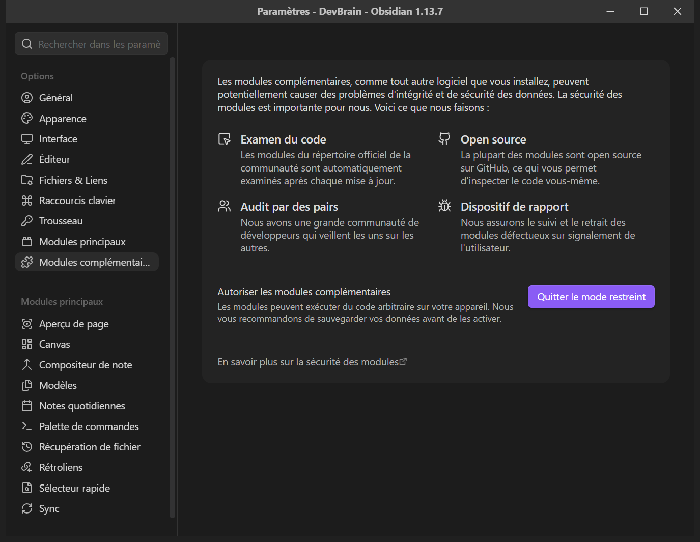
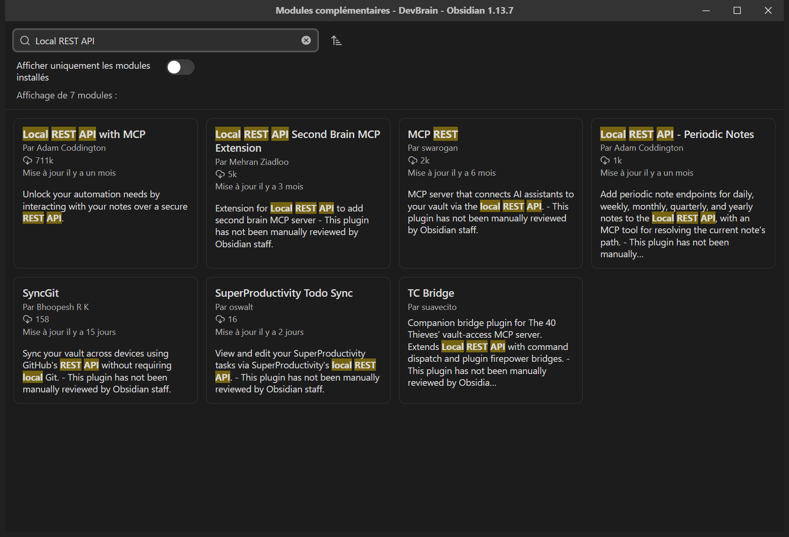
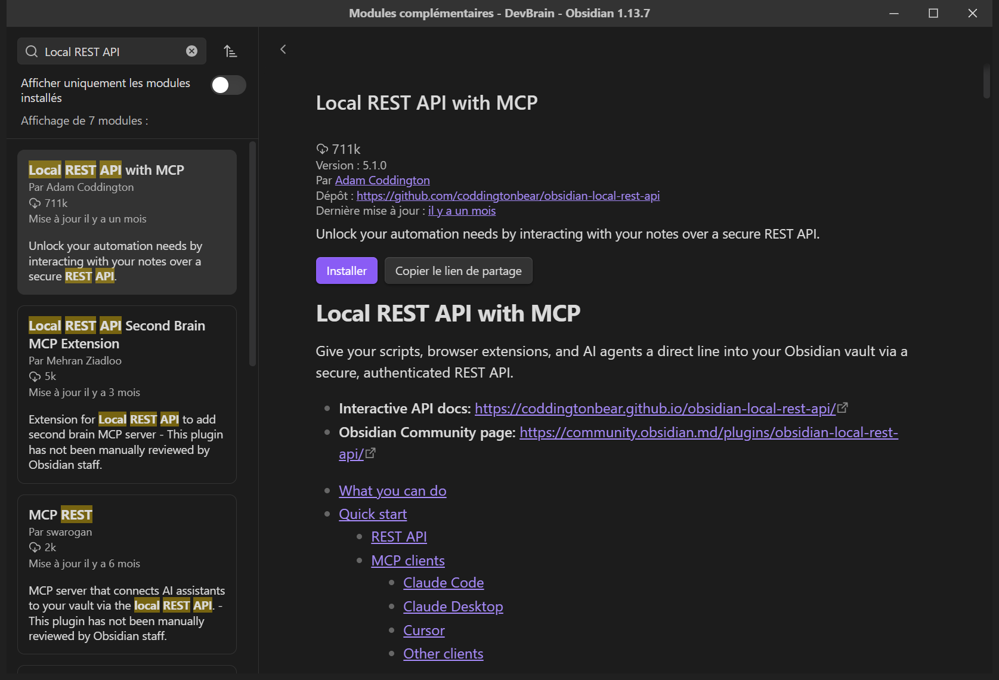
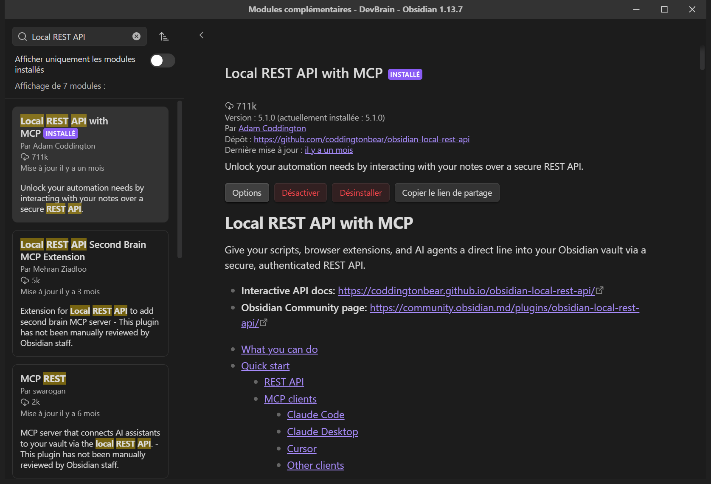
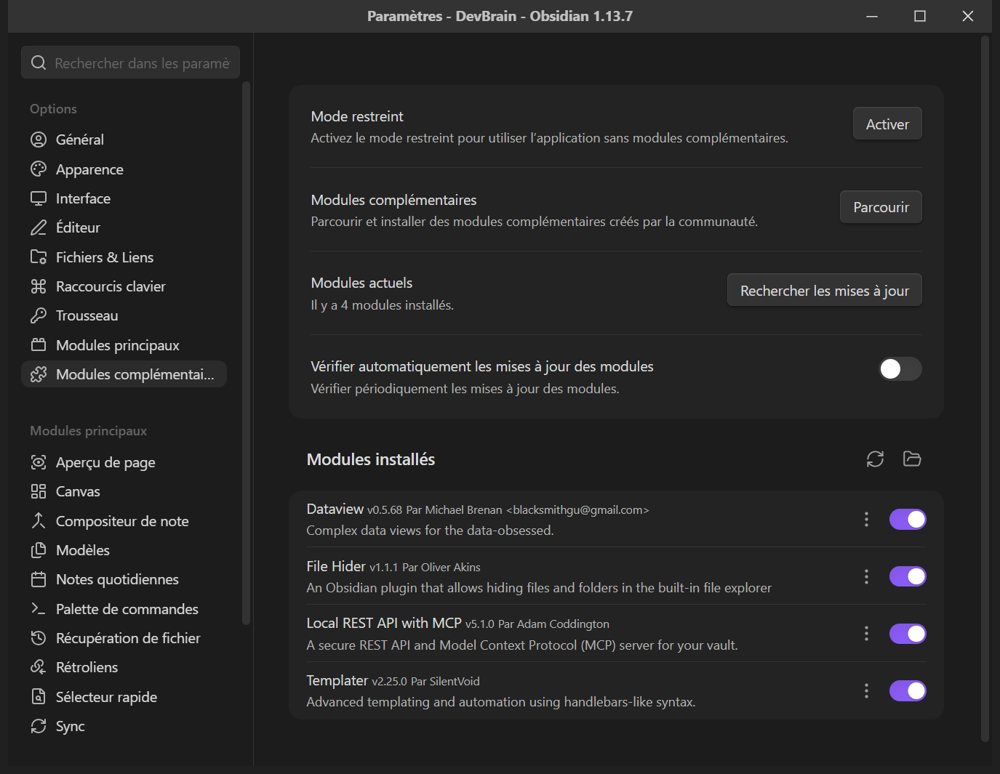
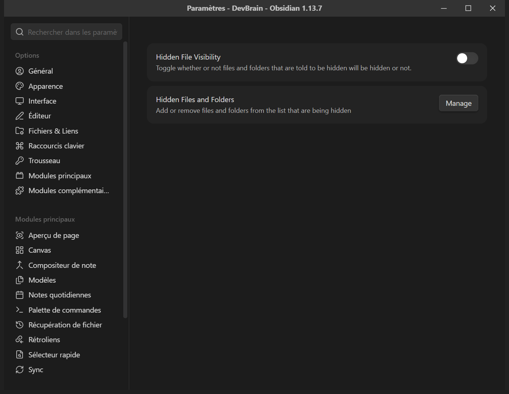
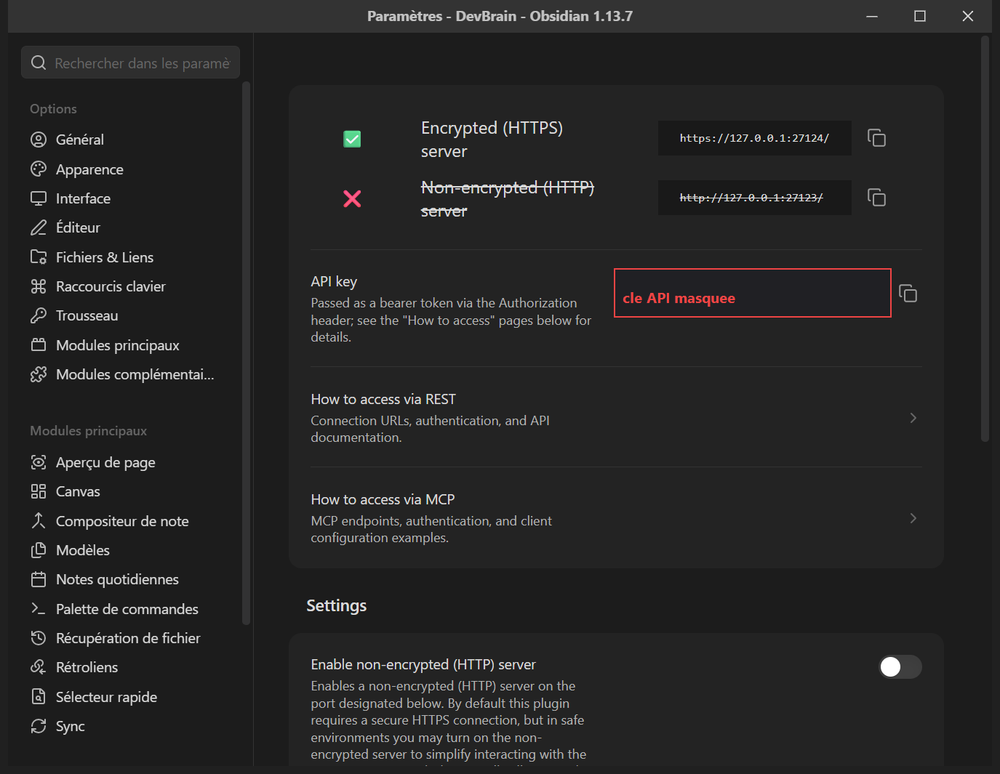

# Configurer Obsidian

Ce chapitre suppose qu'un vault existe déjà. S'il n'y en a pas encore, faire
d'abord [05-premier-brain.md](05-premier-brain.md) §1 à §4 — le semis — puis
revenir ici.

> **Ce chapitre est le seul du dossier dont la justesse repose sur des captures
> et non sur une commande.** Les réglages d'Obsidian ne se vérifient pas par un
> code de sortie. C'est pourquoi les captures y sont nombreuses, et pourquoi
> celles qui manquent encore sont **nommées** plutôt qu'inventées.
>
> **Environnement des captures présentes** : Obsidian **1.13.7** en français,
> sur Windows 11. Les libellés anglais sont entre parenthèses quand ils aident.
> Ces captures ont été prises sur un vault réel : la barre de titre y affiche
> le nom de ce vault. C'est le seul endroit où elles ne sont pas génériques —
> les panneaux, eux, sont ceux d'Obsidian et ne dépendent d'aucun sujet.

---

## Sommaire

1. [Ouvrir le vault](#1-ouvrir-le-vault)
2. [Autoriser les modules complémentaires](#2-autoriser-les-modules-complémentaires)
3. [Installer les plugins](#3-installer-les-plugins)
4. [Pointer Templater sur les gabarits](#4-pointer-templater-sur-les-gabarits)
5. [Masquer ce qui n'est pas une page](#5-masquer-ce-qui-nest-pas-une-page)
6. [Sortir l'espace de l'agent de la recherche et du graphe](#6-sortir-lespace-de-lagent-de-la-recherche-et-du-graphe)
7. [Replier les propriétés en tête de page](#7-replier-les-propriétés-en-tête-de-page)
8. [Colorer le graphe par rôle](#8-colorer-le-graphe-par-rôle)
9. [Brancher l'agent](#9-brancher-lagent)
10. [Ce qui n'est pas versionné, et se refait sur chaque poste](#10-ce-qui-nest-pas-versionné-et-se-refait-sur-chaque-poste)

---

## 1. Ouvrir le vault

Obsidian n'importe rien et ne convertit rien : **un coffre est un dossier de
fichiers**. Ouvrir le vault ne le modifie pas — Obsidian y ajoute seulement un
sous-dossier `.obsidian/` pour sa propre configuration.

À l'écran d'accueil, ou par *Fichier → Ouvrir un coffre*, choisir **Ouvrir un
dossier comme coffre** *(Open folder as vault)* :


Une boîte de dialogue du système s'ouvre. Naviguer jusqu'à la racine du vault —
**celle qui porte `brain.yml`**. On peut aussi coller le chemin dans le champ
du dossier.

> **Capture à prendre en séance** — `img/18-selecteur-dossier-du-vault.png`
> Écran : la boîte de dialogue Windows « Sélectionner un dossier », pointée sur
> la racine d'un vault semé par le kit.
> Avant : avoir semé un brain d'essai, et ouvert le sélecteur de coffre.
> Cadrer : la boîte entière, le chemin du dossier lisible dans le champ.
> Masquer : rien de sensible. Éviter qu'un chemin fasse apparaître un nom de
> tiers.

À la première ouverture, Obsidian peut demander de **faire confiance à
l'auteur** du coffre, parce qu'il y trouve des fichiers de vue. Accepter : ce
sont les fichiers que le semis a posés.

Pour se repérer dans les réglages, le panneau s'ouvre par `Ctrl + ,` *(Cmd + ,
sur Mac)* et affiche d'abord **Général** :


C'est la barre de gauche de ce panneau qu'on utilise dans tout le reste du
chapitre.

---

## 2. Autoriser les modules complémentaires

Un coffre neuf est en **mode restreint** : aucun plugin tiers ne tourne. Le
réglage est **par coffre** — les autres coffres de la machine ne sont pas
touchés.

Paramètres → **Modules complémentaires** *(Community plugins)*. C'est l'état de
départ :



Cliquer sur **Quitter le mode restreint** *(Turn on community plugins)*. Le
panneau change : `Mode restreint` peut se réactiver, et le bouton **Parcourir**
*(Browse)* devient cliquable.


---

## 3. Installer les plugins

**Parcourir** *(Browse)* ouvre le catalogue communautaire :


Pour chacun : chercher son nom, ouvrir sa carte, **Installer** puis **Activer**.

Deux sont requis, deux sont du confort — et la colonne qui compte est la
dernière. **Un plugin dont on ne sait pas dire quel mécanisme l'exige est un
plugin qu'on n'installe pas.**

| Plugin | Auteur | Rôle | Ce qui le rend nécessaire |
|---|---|---|---|
| **Local REST API with MCP** | `coddingtonbear` | expose le coffre en HTTPS sur la boucle locale, et parle MCP | l'agent lit le vault **vivant** — frontmatter résolu, vues évaluées — et pas seulement les fichiers du dépôt. Sans lui, un agent voit le markdown mais pas ce qu'Obsidian en fait |
| **Templater** | `SilentVoid13` | remplit une page neuve depuis un gabarit du dossier des gabarits | les gabarits générés portent un jeton `<% tp.file.title %>` quand le profil est `obsidian` — c'est le kit qui l'écrit, donc c'est le kit qui exige le moteur qui le résout |
| **File Hider** *(confort)* | `eldritch-oliver` | masque un dossier de la barre latérale, sans le supprimer | l'espace de l'agent, les gabarits et la gouvernance sont dans le vault mais ne sont pas des pages : les voir en permanence coûte de l'attention à chaque recherche |
| **Dataview** *(confort)* | `blacksmithgu` | requêtes type SQL sur le frontmatter, en ligne dans une page | rien dans le kit ne l'exige. Il sert de repli quand une version d'Obsidian trop ancienne ne rend pas les vues natives, et pour une requête jetable qu'on ne veut pas figer en page de vue |

### Vérifier l'auteur avant d'installer

C'est le seul vrai piège de cette étape. Plusieurs de ces noms ont des
homonymes dans le catalogue, et un homonyme ne fait pas la même chose. La
recherche du plugin de pont en renvoie **sept** :



Le bon est **Local REST API with MCP**, par **Adam Coddington**
(`coddingtonbear`) — celui qui compte des centaines de milliers de
téléchargements. Les voisins (« Local REST API Second Brain MCP Extension »,
« MCP REST », « Local REST API - Periodic Notes ») ne sont **pas** ceux-là.

Ouvrir sa carte. Avant installation, le bouton dit **Installer** :



Après **Installer** puis **Activer**, la carte porte l'étiquette *INSTALLÉ* et
propose **Options**, **Désactiver**, **Désinstaller** :



Dès qu'il est activé, le serveur tourne. Il n'écoute que sur `127.0.0.1` — donc
inaccessible depuis le réseau local ou depuis internet — et il exige une clé.
Voir [SECURITY.md](SECURITY.md) §1.

### Les trois autres

Même geste. Les pièges d'homonymie à connaître :

| Cherché | À prendre | À ne **pas** prendre |
|---|---|---|
| `Templater` | **Templater**, par SilentVoid13 | le module natif *Modèles* d'Obsidian, qui ne résout pas les jetons |
| `File Hider` | **File Hider**, par eldritch-oliver (Oliver Akins) | *Explorer Hider*, par mara-li — voisin, mais pas celui pour lequel les guides d'instance sont écrits |
| `Dataview` | **Dataview**, par blacksmithgu | — |

### L'état final attendu de l'étape

Revenir à **Modules complémentaires**. Les quatre plugins sont listés sous
*Modules installés*, tous les interrupteurs actifs :



C'est le seul contrôle de cette étape, et il vaut d'être fait : un plugin
installé mais non activé se voit mal, et son absence se manifeste plus tard par
un symptôme qui ne le nomme pas.

---

## 4. Pointer Templater sur les gabarits

Sans ce réglage, Templater ne trouve rien et une page neuve naît vide.

Paramètres → **Templater** (en bas de la barre de gauche, sous *Modules
complémentaires*). Au départ, le champ **Template folder location** est vide :


Y saisir le nom du dossier des gabarits du vault — `Templates` par défaut.
Obsidian complète tout seul ; choisir le dossier lui-même, pas un
sous-dossier :


Le champ est **sensible à la casse**. Les autres options de Templater restent à
leur valeur par défaut.

> **Ces gabarits sont générés depuis le manifeste**, un par rôle. Ne pas les
> éditer à la main : ils se régénèrent, et deux sources qui décrivent le même
> gabarit divergent — c'est le défaut d'origine que le kit existe pour éviter
> ([01-cadrage.md](01-cadrage.md) §1).

---

## 5. Masquer ce qui n'est pas une page

Un vault porte des dossiers qui ne sont pas du contenu : l'espace de l'agent
(`AI/` par défaut), les gabarits, la gouvernance générée. Les voir en
permanence coûte de l'attention à chaque recherche visuelle.

File Hider ne se règle presque pas — il travaille par clic droit. Ses options
ne servent qu'à revoir la liste et à tout réafficher d'un coup :



Fermer les paramètres (`Échap`). Dans l'explorateur, **clic droit sur le
dossier** à masquer, puis **Hide Folder**.

> **Capture à prendre en séance** — `img/14-file-hider-menu-contextuel.png`
> Écran : l'explorateur de fichiers du vault, menu contextuel ouvert sur le
> dossier de l'espace de l'agent.
> Avant : File Hider installé et activé ; l'explorateur affiché en barre
> latérale gauche ; aucun onglet de graphe ouvert.
> Cadrer : la barre latérale **et** le menu contextuel en entier, l'entrée
> « Hide Folder » lisible.
> Masquer : rien. Vérifier qu'aucun autre onglet n'expose de contenu privé.
>
> **Attention, c'est un piège vérifié** : dans le vault d'origine, la capture
> censée montrer ce menu montrait en réalité le panneau du graphe. Contrôler
> l'image après la prise, pas seulement le geste.

> **Capture à prendre en séance** — `img/15-file-hider-apres.png`
> Écran : le même explorateur, après le masquage.
> Avant : avoir cliqué « Hide Folder » sur l'espace de l'agent.
> Cadrer : la barre latérale seule, assez large pour qu'on voie que le dossier
> a disparu et que les autres sont intacts.
> Masquer : rien.

Les fichiers **restent là** : git les suit, l'agent les lit, les commandes les
trouvent. Seule la barre latérale change.

Pour annuler : Paramètres → File Hider → interrupteur **Hidden File
Visibility** sur actif, ce qui réaffiche tout temporairement sans vider la
liste.

---

## 6. Sortir l'espace de l'agent de la recherche et du graphe

Masquer un dossier de la barre latérale ne le sort **pas** de la recherche, du
sélecteur rapide, des suggestions de lien, ni du graphe. C'est un réglage
distinct, et c'est celui qui compte le plus : l'espace de l'agent contient des
résumés de session, des index générés et des notes de travail, qui polluent tout
résultat de recherche.

Paramètres → **Fichiers & Liens** *(Files & Links)* → **Filtres d'exclusion**
*(Excluded files)* → **Gérer** *(Manage)*. Ajouter une entrée par chemin à
exclure :

```text
AI/
```

> **Une seule entrée, pas huit.** Le vault d'origine avait listé huit
> sous-dossiers séparément, et deux d'entre eux — ajoutés plus tard — n'étaient
> couverts par aucun filtre. Exclure le **dossier parent** ferme le cas une fois
> pour toutes ; exclure ses enfants un par un rouvre le trou à chaque nouveau
> sous-dossier.

> **Capture à prendre en séance** — `img/31-fichiers-liens-filtres-exclusion.png`
> Écran : Paramètres → Fichiers & Liens, section « Filtres d'exclusion », avec
> une entrée saisie.
> Avant : avoir ajouté l'espace de l'agent à la liste.
> Cadrer : la section entière, l'entrée lisible, et assez de contexte pour
> qu'on situe la section dans le panneau.
> Masquer : rien.

Ce que ce filtre change, et qu'il faut savoir avant de s'étonner :

| Il exclut de | Il n'exclut pas de |
|---|---|
| la recherche globale | l'explorateur de fichiers (c'est le rôle de File Hider, §5) |
| le sélecteur rapide | l'accès par un lien direct ou par un chemin |
| les suggestions de lien | ce que l'agent lit — il passe par le système de fichiers |
| le graphe | ce que git suit |

Pour le graphe, ce filtre suffit dans la plupart des cas. Un graphe particulier
peut en plus recevoir une exclusion locale, dans son propre panneau
**Filtres** *(Filters)*, en préfixant un chemin d'un tiret :

```text
-path:<le dossier à sortir de ce graphe>
```

---

## 7. Replier les propriétés en tête de page

Une page du kit porte un frontmatter **dense** : c'est là que vivent le rôle,
l'axe de rangement, les liens typés, les champs indexés. C'est ce qui rend le
brain interrogeable — et c'est aussi une dizaine de lignes avant le premier mot
du texte.

Obsidian sait replier ce bloc sans le supprimer.

Paramètres → **Éditeur** *(Editor)* → **Propriétés dans le document**
*(Properties in document)*. Trois valeurs :

| Valeur | Effet | Quand la choisir |
|---|---|---|
| **Visible** | le bloc est rendu en tableau de propriétés en haut de la page | pendant qu'on écrit des fiches, pour voir ce qu'on remplit |
| **Masqué** *(Hidden)* | le bloc n'est pas rendu ; il reste dans le fichier et se modifie par le panneau latéral des propriétés | pour **lire** le brain : la page commence par son texte |
| **Source** | le bloc est rendu en YAML brut | pour déboguer un frontmatter qu'un validateur refuse |

Le réglage est **par coffre** et n'écrit rien dans les pages : c'est un choix
d'affichage, réversible à tout moment.

> **Capture à prendre en séance** — `img/30-editeur-proprietes-masquees.png`
> Écran : Paramètres → Éditeur, section des propriétés du document, avec le
> sélecteur ouvert ou sa valeur visible.
> Avant : rien de particulier.
> Cadrer : le libellé du réglage et sa valeur. Si le sélecteur déroulant est
> ouvert, cadrer les trois valeurs.
> Masquer : rien.

> **Ce que « Masqué » ne fait pas** : il ne cache pas le frontmatter à
> l'agent, ni aux validateurs, ni au graphe, ni aux vues. Un champ masqué
> à l'écran est toujours un champ que le kit lit — et une règle dure qui porte
> sur lui échouera quand même. Masquer est un confort de lecture, jamais une
> façon de se dispenser de remplir.

---

## 8. Colorer le graphe par rôle

Le graphe d'Obsidian devient un outil de lecture le jour où il porte **une
couleur par rôle** : on voit d'un coup d'œil où sont les hubs, où sont les
unités, et quelles pages ne sont reliées à rien.

### D'abord, activer le module natif

S'il n'y a pas d'entrée **Affichage du graphique** *(Graph view)* dans les
paramètres, le module natif est désactivé :

1. Paramètres → **Modules principaux** *(Core plugins)*
2. chercher **Affichage du graphique** *(Graph view)*
3. activer l'interrupteur

Une icône de graphe apparaît alors dans la barre latérale gauche.

### Puis saisir les groupes

1. ouvrir le graphe par son icône ;
2. dans le **panneau du graphe** (pas les paramètres de l'application), cliquer
   l'icône d'engrenage, en haut à droite ;
3. onglet **Groupes** *(Groups)* ;
4. **Nouveau groupe** *(New group)*, une fois par ligne de la table, **dans
   l'ordre** ;
5. pour la couleur : cliquer le carré à droite de la requête, et saisir les
   trois valeurs **R / G / B** au bas du sélecteur.

> **Capture à prendre en séance** — `img/16-graphe-groupes-reglages.png`
> Écran : le panneau du graphe, onglet Groupes, avec une requête saisie et son
> sélecteur de couleur ouvert.
> Avant : ouvrir le graphe d'un vault semé par le kit, puis son engrenage, puis
> Groupes. Saisir **une** requête et ouvrir son sélecteur de couleur.
> Cadrer : le panneau Groupes en entier plus le sélecteur de couleur, avec les
> champs R / G / B visibles — c'est le champ qu'on cherche, et il est en bas.
> Masquer : rien. La requête montrée doit être celle d'un vault d'essai, pas
> celle d'un brain de tiers.

> **Capture à prendre en séance** — `img/25-graphe-colore.png`
> Écran : le graphe entier, après application de toute la table.
> Avant : avoir saisi toutes les lignes du groupe, dans l'ordre, et fermé le
> panneau.
> Cadrer : la zone du graphe, sans la barre latérale si possible — c'est la
> répartition des couleurs qu'on montre, pas l'arborescence.
> Masquer : les noms de page si le vault d'essai porte du contenu de tiers.
> Un vault de démonstration évite la question.

### La table elle-même n'est pas dans ce document, et c'est voulu

Elle vit dans le **manifeste de l'instance**, sous la clé des couleurs, et
l'instance la rend dans sa propre documentation générée — un fichier
`Documentation/graphe.md` et une section de son `INSTALL.md`. Écrire ici une
table de rôles serait écrire un sujet dans la doc du kit : les rôles d'un brain
d'histoire ne sont pas ceux d'un brain de droit du travail.

### Deux faits qui valent pour tout brain

Ils ne se retrouvent pas en réessayant, alors autant les lire une fois :

- **l'ordre des requêtes compte.** Obsidian applique la **première** règle qui
  correspond. Une règle qui cible un **chemin** doit donc passer **avant** une
  règle qui cible un **rôle**, sinon un hub spécial — celui qui rassemble les
  vues, celui d'un axe transverse — prend la couleur des hubs ordinaires et
  devient introuvable à l'œil.
- **un fichier de vue ne se colore pas.** Il n'a pas de frontmatter, donc pas de
  rôle : aucune requête ne peut l'atteindre. Il apparaît dans la couleur par
  défaut, tenu par l'unique arête de l'embed de sa page. Ce n'est pas un réglage
  à trouver, c'est une limite à connaître.

---

## 9. Brancher l'agent

Le semis a déjà écrit, à la racine de l'instance, le routeur de l'agent et ses
skills. Il n'y a rien à rédiger : tout sort du manifeste.

Ce qui reste à faire est de laisser l'agent atteindre le vault **vivant** —
frontmatter résolu, vues évaluées — et pas seulement ses fichiers.

Paramètres → **Modules complémentaires** → ligne du plugin de pont → icône
d'engrenage. Le panneau donne l'URL locale et la clé :



Plus bas, la section **How to access via MCP** donne l'adresse du point d'entrée
et le bloc de configuration à coller côté agent :


> Sur cette capture, le bloc de configuration lui-même est **sous la ligne de
> pliure** : on voit son titre, pas son contenu. Le bloc est de toute façon à
> copier depuis l'écran, jamais depuis une image — il contient la clé.

**La clé donne un accès complet en lecture et en écriture au coffre.** Elle se
traite comme un mot de passe, elle ne se committe jamais, et elle n'a pas sa
place dans une capture. Voir [SECURITY.md](SECURITY.md) §1.

Côté agent, la façon de déclarer un serveur MCP dépend de l'agent : le bloc que
le plugin affiche est prêt à coller pour les clients les plus courants. Une fois
déclaré, le contrôle est que l'agent réponde.

> **Capture à prendre en séance** — `img/28-agent-connecte.png`
> Écran : le terminal de l'agent, après une demande de lister quelques pages du
> vault.
> Avant : Obsidian ouvert sur le vault, plugin de pont activé, serveur MCP
> déclaré côté agent. Demander à l'agent de lister trois pages.
> Cadrer : la demande et la réponse, assez pour qu'on voie que ce sont des
> pages du vault.
> Masquer : **la clé d'API si elle apparaît dans une ligne de configuration ou
> une variable d'environnement.** C'est la capture la plus risquée du lot.

---

## 10. Ce qui n'est pas versionné, et se refait sur chaque poste

C'est la surprise classique du deuxième poste.

| Réglage | Versionné ? | Conséquence |
|---|---|---|
| plugins installés | non — `.obsidian/plugins/` est en général ignoré | à réinstaller sur chaque poste |
| dossier des gabarits de Templater | non | à re-saisir |
| dossiers masqués par File Hider | non | à refaire |
| filtres d'exclusion | non | à refaire |
| propriétés en tête de page | non | à refaire |
| **groupes du graphe** | non | à ré-appliquer depuis la table du manifeste |
| le manifeste, les pages, les gabarits générés, les hooks | **oui** | ils arrivent avec le clone |

La ligne qui compte est la table de couleurs : **le manifeste en est la seule
source**, et c'est ce qui rend la ré-application possible plutôt que
pénible. Un réglage d'affichage perdu se retrouve dans un fichier ; il ne se
reconstitue pas de mémoire.

---

## Ensuite

| Question | Document |
|---|---|
| créer un brain, ou en créer un autre | [05-premier-brain.md](05-premier-brain.md) |
| l'usage de tous les jours | [06-manuel.md](06-manuel.md) |
| un réglage ne prend pas | [08-depannage.md](08-depannage.md) |
