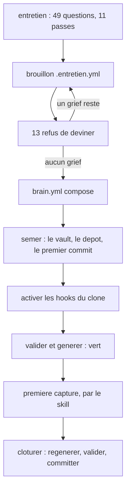

# Premier brain — de rien à un vault vert

Ce chapitre suppose que `brainkit` répond
([03-installation.md](03-installation.md)). À la fin, il y a un vault, il est
vert aux deux validateurs, et il ne contient **aucune page** en dehors de ses
hubs — ce qui est le résultat correct, pas un semis incomplet.

> **Durée** : l'entretien prend le temps qu'on lui donne, et c'est le point
> (§2). Le semis lui-même prend quelques secondes.

---

## Sommaire

1. [La séquence, en une vue](#1-la-séquence-en-une-vue)
2. [L'entretien — les 49 questions](#2-lentretien--les-49-questions)
3. [Composer le manifeste](#3-composer-le-manifeste)
4. [Semer l'instance](#4-semer-linstance)
5. [Activer les garde-fous de l'instance](#5-activer-les-garde-fous-de-linstance)
6. [Vérifier que le vault est vert](#6-vérifier-que-le-vault-est-vert)
7. [Ce que le semis a posé](#7-ce-que-le-semis-a-posé)
8. [La première capture](#8-la-première-capture)
9. [Clôturer](#9-clôturer)

---

## 1. La séquence, en une vue



Deux points de forme, valables partout dans le kit :

- **le mode par défaut n'écrit jamais.** `semer` sans `--ecrire` dit ce qu'il
  ferait. Lancer une commande pour voir ce qu'elle ferait est son premier usage,
  et cela ne doit rien coûter.
- **un refus rend la question, il ne pose pas une valeur.** C'est vrai des
  treize refus de l'entretien comme des quatre refus du semis.

---

## 2. L'entretien — les 49 questions

```bash
brainkit entretien --questions      # les 11 passes, et ce que chaque question produit
brainkit entretien --refus          # les 13 choses qu'il REFUSE de deviner
```

Ces deux commandes n'écrivent rien et se lisent avant de commencer. La seconde
mérite deux minutes : savoir d'avance ce qui ne se devinera pas évite de
répondre au jugé.

### Ce n'est pas un formulaire, et c'est le point

L'entretien **induit** l'axe de rangement à partir de **vingt titres réels**
qu'on cite, au lieu de demander « quels sont tes domaines ? ».

> **Problème** : comment obtenir un axe de rangement qui tienne à 300 pages ?
> **Options** : (a) demander la liste des domaines, (b) proposer une taxonomie
> par sujet, (c) faire citer vingt titres réels et en induire l'axe.
> **Retenu** : (c), **plutôt que** (a) **parce qu'**une liste donnée à froid
> décrit ce qu'on croit ranger, et vingt titres décrivent ce qu'on a vraiment ;
> **plutôt que** (b) **parce qu'**une taxonomie fournie serait exactement le
> sujet que le kit refuse de connaître. **Limite** : il faut réunir vingt
> titres, ce qui suppose de savoir de quoi on veut parler. C'est une bonne
> barrière.

### Les treize refus

Ils portent sur ce qui ne se rattrape pas. Le premier est l'**identité git** :
une identité devinée entre dans l'historique du dépôt et n'en sort plus sans
réécriture. Un refus **nomme le champ** et rend la question.

### Qui pose les questions

L'entretien est une conversation, et c'est un **skill** qui la mène :
[`../skills/entretien/SKILL.md`](../skills/entretien/SKILL.md), dans ce dépôt.
On le charge dans l'agent, depuis le dépôt du kit, et on répond.

Les commandes ci-dessous sont celles que le skill appelle. On peut aussi s'en
servir à la main, et c'est ce que la suite décrit.

### Les six commandes du brouillon, dans l'ordre

```bash
# 1. ou on en est — c est le mode par defaut, il ne touche rien
brainkit entretien --brouillon mon-brain.entretien.yml

# 2. repondre, une question a la fois. La valeur est lue en YAML :
#    une chaine, une liste, un dictionnaire — selon ce que la question attend.
brainkit entretien --brouillon mon-brain.entretien.yml \
    --repondre '0.2=MonBrain' --repondre '0.3=perso'

# 3. relire ce qui a deja ete dit, avant de reprendre
brainkit entretien --brouillon mon-brain.entretien.yml --rappel

# 4. rouvrir une question : la reponse est effacee et la question reposee
brainkit entretien --brouillon mon-brain.entretien.yml --oublier 2.2

# 5. passer les treize refus sur l etat courant
brainkit entretien --brouillon mon-brain.entretien.yml --verifier

# 6. composer le manifeste — REFUSE s il reste un grief
brainkit entretien --brouillon mon-brain.entretien.yml --composer mon-brain.brain.yml
```

`--oublier` est la bonne façon de changer d'avis. Écraser une réponse par une
autre laisserait le brouillon en dire deux choses.

### La porte de service, et ce qu'elle coûte

```bash
brainkit entretien --brouillon mon-brain.entretien.yml --reponses lot.yml
```

`--reponses` accepte un lot entier de réponses d'un coup, sans conversation.
C'est ce qui rend le jeu d'épreuve possible : rejouer un entretien complet est
la seule façon de **prouver** qu'un entretien produit un vault vert.

Ce qu'on saute en l'employant : les treize refus tournent toujours sur le
brouillon et sur le manifeste composé, **pas** sur la conversation. Ce qu'on
perd, c'est le moment où une question ouverte fait changer d'avis — et c'est là
qu'est la valeur de l'entretien. À employer pour **rejouer**, pas pour se
dispenser de réfléchir.

Deux fichiers de réponses complets servent d'exemples de forme :
[`../tests/cimebrain.reponses.yml`](../tests/cimebrain.reponses.yml) (un brain
de montagne) et [`../tests/blanc.reponses.yml`](../tests/blanc.reponses.yml) (un
brain de droit du travail, né de l'installation à blanc qui a validé cette
documentation). Chacun porte en tête le raisonnement de son sujet : c'est la
**forme** à copier, pas le contenu.

---

## 3. Composer le manifeste

`--composer` écrit `mon-brain.brain.yml`. Il **refuse** s'il reste un grief, et
il les rend **tous d'un coup**.

Le manifeste peut ensuite être relu contre son contrat :

```bash
uv run schema/valider.py mon-brain.brain.yml
```

Trois manifestes complets servent de référence dans
[`../exemples/`](../exemples), dont un **contre-exemple** qui doit échouer —
c'est lui qui prouve que le contrat contrôle vraiment quelque chose.

> **Un manifeste se relit à la main, et se modifie à la main.** C'est le seul
> fichier du système dans ce cas. Les `motif:` qu'on y écrit — la raison pour
> laquelle une règle est en avertissement plutôt qu'en dur — sont la moitié de
> sa valeur, et aucun outil ne les produit.

---

## 4. Semer l'instance

```bash
brainkit semer --manifeste mon-brain.brain.yml --dans ~/MonBrain
brainkit semer --manifeste mon-brain.brain.yml --dans ~/MonBrain --ecrire
```

La première ligne n'écrit **pas un octet** et imprime ce qu'elle ferait,
fichier par fichier. La seconde écrit.

On peut aussi semer directement depuis le brouillon, sans passer par un fichier
de manifeste intermédiaire :

```bash
brainkit entretien --brouillon mon-brain.entretien.yml --semer ~/MonBrain --ecrire
```

### Les quatre refus du semis

Aucun n'est négociable, et chacun évite une perte.

| Refus | Ce qu'il évite |
|---|---|
| la cible existe et n'est pas vide | écraser un vault qu'on croyait absent |
| la cible vit sous le dépôt du kit | versionner une instance dans le kit |
| la cible vit sous un dépôt git | semer dans un dépôt qui n'est pas le sien |
| la cible vit sous un vault | semer un brain à l'intérieur d'un autre |

Il refuse en plus un **manifeste incomplet**, et il rend tous les manques d'un
coup, **avant** d'avoir écrit quoi que ce soit. Un vault à demi semé fait dire
n'importe quoi à ses validateurs, et le premier geste de l'utilisateur serait de
réparer une structure que personne n'a cassée.

### Ce que le semis ne fait pas

**Il n'écrit aucune page.** Un brain neuf porte un hub par dossier et rien
d'autre.

C'est le critère de justesse du semis, pas une limite : un semis qui poserait
des pages de démonstration poserait du contenu que personne n'a écrit — et il
faudrait ensuite le distinguer du vrai. Ce que l'entretien a récolté, les vingt
titres de la passe d'induction, est posé dans la page de capture **en cases à
cocher** : du travail identifié, pas du contenu fabriqué.

---

## 5. Activer les garde-fous de l'instance

Le semis a créé le dépôt de l'instance, posé son identité locale et fait son
premier commit. Mais comme pour le kit, **git ne lit pas les hooks tant qu'on ne
le lui dit pas** :

```bash
cd ~/MonBrain
git config core.hooksPath .githooks
git config core.hooksPath                 # doit repondre .githooks
```

Vérifier au passage l'identité locale du dépôt — celle que le semis a posée
depuis les réponses de l'entretien :

```bash
git config --local user.name
git config --local user.email
```

Si l'une des deux manque ou paraît fausse : **la poser, ou demander**. Ne pas la
deviner. C'est le premier des treize refus, et il vaut aussi après le semis.

---

## 6. Vérifier que le vault est vert

Trois commandes, depuis la racine du vault. Ce sont **les mêmes** que celles de
tous les jours : il n'y a pas de mode « vérification d'installation » à part.

```bash
cd ~/MonBrain
brainkit valider
brainkit generer
git status --porcelain
```

| Commande | Attendu | Ce qu'une autre sortie veut dire |
|---|---|---|
| `valider` | code **0**, `aucune violation dure` | une violation dure sur un vault qu'on vient de semer n'est pas un défaut du vault : c'est le mauvais manifeste, ou une régénération non faite |
| `generer` (mode `--check` par défaut) | code **0**, aucun écart | un écart veut dire qu'un artefact dérivé a été édité à la main, ou n'a pas été régénéré après une écriture |
| `git status --porcelain` | **vide** | quelque chose a été écrit sans être committé : la clôture n'a pas été faite |

Sur une instance **fraîchement semée**, les trois répondent : zéro violation
dure, **zéro avertissement**, zéro écart, arbre propre.

Le zéro avertissement est plus fort qu'il n'y paraît. Sur un vault à zéro page
d'unité, tout avertissement porterait sur une page que personne n'a écrite : il
signalerait donc un défaut du **kit**, pas du brain.

> **Capture à prendre en séance** — `img/26-verdict-valider.png`
> Écran : le terminal, sortie complète de `brainkit valider` sur un vault
> fraîchement semé.
> Avant : semer un brain d'essai, s'y placer, lancer la commande.
> Cadrer : la commande tapée **et** tout le verdict, jusqu'au code de sortie.
> Masquer : rien. Vérifier qu'aucune variable d'environnement ne s'affiche dans
> l'invite du terminal.

> **Capture à prendre en séance** — `img/27-verdict-generer-check.png`
> Écran : le terminal, sortie de `brainkit generer` en mode `--check`.
> Avant : le même vault, juste après la commande précédente.
> Cadrer : la commande et le rapport entier, avec la ligne qui dit qu'il ne
> reste aucun écart.
> Masquer : rien.

---

## 7. Ce que le semis a posé

Un dossier par valeur de l'axe de rangement, à la racine, et rien à côté.
**Personne ne choisit un chemin** : il se dérive du champ de rangement de la
page.

> **Capture à prendre en séance** — `img/19-arbre-du-vault.png`
> Écran : la barre latérale d'Obsidian, l'arbre des dossiers de l'axe de
> rangement déplié sur **un** niveau.
> Avant : ouvrir le vault dans Obsidian, replier tout, puis déplier la racine.
> Cadrer : la barre latérale, assez haute pour montrer tous les dossiers de
> premier niveau et les fichiers de la racine.
> Masquer : rien, sur un vault de démonstration.

> **Capture à prendre en séance** — `img/20-porte-d-entree.png`
> Écran : la porte d'entrée du vault ouverte en mode lecture, à côté de l'arbre.
> Avant : ouvrir la page d'accueil que le semis a posée à la racine.
> Cadrer : l'arbre à gauche **et** la page à droite, dans le même écran — c'est
> le rapport entre les deux qu'on montre.
> Masquer : rien.

Les autres dossiers, et ce qu'ils sont :

| Dossier | Contenu | Généré ? |
|---|---|---|
| un par valeur de l'axe | les pages, et un hub à son nom | le hub oui, sa **zone** générée ; son corps s'écrit à la main |
| le dossier des gabarits | un gabarit par rôle | **oui**, entièrement |
| le dossier de gouvernance | la taxonomie, les vocabulaires, la table de couleurs | **oui**, entièrement |
| l'espace de l'agent | le routeur, les skills, les ponts, l'index, la carte des liens | **oui**, entièrement |
| `brain.yml` | le manifeste | non — c'est **la** source |

> **Capture à prendre en séance** — `img/24-hub-zone-auto.png`
> Écran : un hub ouvert, sa zone générée **et** son corps écrit à la main
> visibles dans le même écran.
> Avant : ouvrir le hub d'un dossier qui contient au moins deux pages, en mode
> lecture ; l'avoir doté d'un corps écrit à la main, sinon la capture ne montre
> qu'une moitié du sujet.
> Cadrer : les bornes de la zone générée doivent être lisibles — c'est la
> frontière qu'on montre.
> Masquer : rien.

---

## 8. La première capture

Écrire dans un brain n'est pas créer un fichier. **C'est déclencher une
propagation** : la page, son hub, les pages voisines du dossier, la vue qui la
départage, l'index, la carte des liens.

C'est pour cela que le semis pose un **skill de capture** dans l'instance : le
skill porte le rayon de la propagation, et ce rayon n'est pas déductible du
contenu de la page. Le guide `enrichir.md` de l'instance — généré depuis son
manifeste — donne sa table de propagation, avec les mots du brain.

Trois skills, et le découpage est **structurel**, pas thématique :

| Skill | Ce qu'il fait |
|---|---|
| capture | **écrit** dans le brain, et propage |
| clôture | clôt **toute** écriture : régénérer, valider, committer |
| exploitation | **consomme** le brain depuis un travail, sans y écrire |

Tout brain a besoin des deux premiers. Le troisième peut légitimement ne pas
exister, et son absence est alors **écrite** plutôt que remplie par un skill
creux.

La première section du routeur de l'agent est la **règle d'identité git**, et ce
n'est pas un choix de mise en page : c'est le seul fichier chargé dans
**chaque** conversation, au même moment que l'annonce de l'outil. Une
contre-instruction qui arrive après coup arrive trop tard.

> **Capture à prendre en séance** — `img/21-page-d-unite-proprietes.png`
> Écran : une page d'unité en mode lecture, frontmatter **déplié** (réglage
> « Visible », cf. [04-obsidian.md](04-obsidian.md) §7).
> Avant : avoir capturé une première page réelle. Une page vide ne montrerait
> rien.
> Cadrer : tout le bloc de propriétés plus les premières lignes du texte —
> c'est cette capture qui montre à quoi sert le manifeste.
> Masquer : rien, sur un vault de démonstration.

> **Capture à prendre en séance** — `img/22-bandeau-genere.png`
> Écran : le haut d'une page d'unité, haut de page généré visible, **dont une
> cellule vide**.
> Avant : capturer une page dont un champ de haut de page n'est pas renseigné.
> C'est le sujet de la capture : la règle « un tiret cadratin, jamais une valeur
> plausible » ne se voit que là.
> Cadrer : le tableau du haut de page en entier, la cellule vide comprise.
> Masquer : rien.

> **Capture à prendre en séance** — `img/23-page-de-vue.png`
> Écran : une page de vue — la table filtrée embarquée, et la section écrite à
> la main juste en dessous.
> Avant : le vault doit porter au moins trois unités comparables, sinon la table
> est vide et la capture ne montre rien.
> Cadrer : la fin de la table **et** le début de la section écrite à la main,
> dans le même écran : c'est leur voisinage qui est le sujet.
> Masquer : rien.

---

## 9. Clôturer

**Toute écriture dans le brain se clôt.** Ce n'est pas une politesse : les
artefacts dérivés sont faux jusqu'à leur régénération, et un vault dont les
zones générées sont en retard fait échouer son propre contrôle.

La séquence, qui est celle du skill de clôture :

```bash
brainkit generer --ecrire        # regenerer les quatre artefacts derives
brainkit valider                 # zero violation dure
brainkit generer                 # --check : plus aucun ecart
git add -A && git commit         # committer NU : git lit l identite locale
```

**Committer nu** : sans passer d'identité en ligne de commande, sans variable
d'environnement d'auteur. Git lit la config locale du dépôt tout seul, ce qui
est exactement le comportement voulu, et les trois hooks refusent le reste.

---

## Ensuite

| Question | Document |
|---|---|
| régler Obsidian sur ce vault | [04-obsidian.md](04-obsidian.md) |
| l'usage de tous les jours | [06-manuel.md](06-manuel.md) |
| livrer ce brain là où l'on n'installe rien | [07-livrer-une-instance.md](07-livrer-une-instance.md) |
| une commande refuse | [08-depannage.md](08-depannage.md) |
