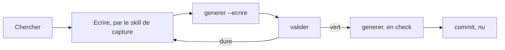

# Manuel d'utilisation

L'usage de tous les jours, une fois qu'un brain existe et qu'Obsidian est réglé.

> **Ce document parle du kit, pas d'un brain.** Il nomme des commandes, des
> codes de sortie et des habitudes. Le manuel de **votre** brain — ses rôles,
> ses axes, ses champs indexés, ses sections de page — est **généré dans le
> vault** par le semis : `manuel.md`, `enrichir.md`, `exploiter.md`. Un exemple
> complet est lisible dans
> [`../gabarit/rendu/`](../gabarit/rendu).

---

## Sommaire

1. [Les huit commandes, en une table](#1-les-huit-commandes-en-une-table)
2. [La boucle de tous les jours](#2-la-boucle-de-tous-les-jours)
3. [Chercher](#3-chercher)
4. [Capturer](#4-capturer)
5. [Mettre à jour une page qui existe](#5-mettre-à-jour-une-page-qui-existe)
6. [Régénérer, et le contrôle qui va avec](#6-régénérer-et-le-contrôle-qui-va-avec)
7. [Valider](#7-valider)
8. [Mesurer avant de durcir](#8-mesurer-avant-de-durcir)
9. [Sonder l'amont](#9-sonder-lamont)
10. [Changer le seuil de promotion](#10-changer-le-seuil-de-promotion)
11. [Ce qu'on n'édite jamais à la main](#11-ce-quon-nédite-jamais-à-la-main)

---

## 1. Les huit commandes, en une table

Toutes se lancent **depuis la racine du vault** : elles résolvent `./brain.yml`
et le vault courant sans option.

| Commande | Écrit ? | Fréquence | Ce qu'elle fait |
|---|---|---|---|
| `brainkit valider` | non | à chaque écriture | les dix règles, plus les contrôles de socle que le manifeste déclare |
| `brainkit generer` | **non** par défaut (`--check`) | à chaque écriture | contrôle les quatre artefacts dérivés ; `--ecrire` les réécrit |
| `brainkit mesurer` | non | avant de durcir une règle | ce qu'une règle **coûterait**, et les garde-fous qui l'interdisent trop tôt |
| `brainkit sonder` | side-car seulement | périodique | l'**amont** d'une unité : dernière version publiée, dernier commit, dépôt archivé |
| `brainkit entretien` | le brouillon | une fois par brain | les 49 questions qui produisent un manifeste |
| `brainkit semer` | non par défaut | une fois par brain | crée le vault |
| `brainkit re-seuiller` | non par défaut | rare | change le seuil de promotion — une **migration**, par `git mv` |
| `brainkit freeze` | non par défaut | à la livraison | copie le kit **dans** l'instance, et coupe la dépendance |

**Deux habitudes valent tous les mémentos** : lancer d'abord sans `--ecrire` /
`--appliquer`, et lire le code de sortie. Un `0` n'est pas la même chose qu'un
`2`.

---

## 2. La boucle de tous les jours



Cette boucle **est** le skill de clôture. On peut la faire à la main ; le skill
existe pour qu'on ne l'oublie pas, parce que sauter la régénération laisse un
vault dont les agrégats mentent sans qu'il le dise.

---

## 3. Chercher

Trois chemins, du plus rapide au plus sûr.

### a. À l'œil, dans Obsidian

Le voisinage d'une page **est le contenu de son dossier**. C'est ce que l'arbre
achète : plus rien à déduire d'une liste d'étiquettes. Le hub du dossier porte
une zone générée qui liste ce qu'il contient.

Le graphe coloré par rôle sert au même but à plus grande échelle : il montre où
sont les hubs, et surtout quelles pages ne sont reliées à rien
([04-obsidian.md](04-obsidian.md) §8).

### b. Par l'index, quand on veut filtrer

Le catalogue machine est sous l'espace de l'agent, dans `AI/index/` :
`brain-index.json` (pour un agent ou un script), `brain-index.md` (pour un
humain), `liens.md` (la carte des liens).

Il est **généré**. Il ne s'édite pas, il se régénère.

Les champs indexés sont ceux que le manifeste déclare : la liste est dans le
guide `exploiter.md` du vault, avec les mots du brain.

Deux réserves qui valent d'être connues **avant** de filtrer :

- un champ d'énumération **ouverte** ne se filtre pas par égalité exacte sans
  rater des pages qui portent une valeur composée ;
- **un champ vide n'est pas une valeur** : c'est une question ouverte. Une page
  au champ vide ne doit pas être éliminée comme si elle avait répondu.

### c. Par l'agent

C'est le cas d'usage principal, et il exige le pont
([04-obsidian.md](04-obsidian.md) §9) : l'agent lit alors le vault **vivant** —
frontmatter résolu, vues évaluées — au lieu des fichiers bruts.

La règle qui commande cet usage est écrite dans le guide `exploiter.md` du
vault, et elle est courte : **on ne travaille pas dans le vault**. On y lit,
depuis un projet qui vit ailleurs.

---

## 4. Capturer

**On ne crée pas une page, on déclenche une propagation.** C'est la phrase à
retenir de tout ce manuel.

Écrire une page touche, au minimum : la page, le hub de son dossier et ses hubs
parents, la vue qui la départage, les pages voisines qui doivent la citer en
retour, l'index, la carte des liens.

Ce rayon n'est **pas** déductible du contenu de la page. C'est pourquoi la
capture passe par le **skill de capture** posé dans le vault : il porte la table
de propagation, générée depuis le manifeste. Le guide `enrichir.md` du vault la
rend lisible pour un humain.

Ce que le skill fait, et qu'il ne faut donc pas faire à la main :

| Il fait | Il ne fait pas |
|---|---|
| dériver le chemin depuis le champ de rangement | choisir un dossier |
| poser le gabarit du rôle | recopier un frontmatter d'une autre page |
| câbler les liens **dans les deux sens** | laisser un lien à sens unique |
| mettre à jour la vue et les pages voisines | vous laisser les retrouver |
| laisser un champ vide quand la valeur n'est pas connue | inventer une valeur plausible |

La dernière ligne est la plus importante : **une fiche vide honnêtement vaut
mieux qu'une fiche remplie au jugé.**

---

## 5. Mettre à jour une page qui existe

Ce n'est pas un patch improvisé. Un champ modifié a des **consommateurs** :

| Ce qu'on change | Qui doit suivre |
|---|---|
| le champ de rangement | le **chemin** de la page — c'est un déplacement, par `git mv` |
| le rôle | le gabarit appliqué, donc les sections attendues |
| un lien typé | la page citée, qui doit citer en retour |
| un champ indexé | l'index, la carte des liens, la vue qui l'affiche |
| un champ de haut de page | le haut de page généré de la page |
| le corps d'un hub | rien — c'est la zone **générée** qui est intouchable, pas la page |

Un **déplacement se fait par `git mv`**, jamais par suppression puis création :
sans quoi l'historique de la page est perdu.

Le guide `enrichir.md` du vault porte la procédure complète en mode mise à jour,
champ par champ, avec la commande de vérification de chacun.

---

## 6. Régénérer, et le contrôle qui va avec

Quatre artefacts se dérivent du contenu, et se régénèrent :

```bash
brainkit generer                        # --check : n ecrit rien, sort en 2 sur ecart
brainkit generer --ecrire               # reecrit dans le vault
brainkit generer --quoi index,hubs      # seulement ces artefacts
brainkit generer --sortie ../travail    # ecrire HORS du vault, pour comparer
```

| Artefact | Ce qu'il agrège |
|---|---|
| l'index | le frontmatter de toutes les pages, en JSON et en markdown |
| les zones générées des hubs | le contenu de chaque dossier, et les axes transverses |
| la carte des liens | qui cite qui |
| les hauts de page | les champs de bandeau de chaque page qui en porte un |

**`--check` est le mode par défaut, et c'est la forme vérifiable du contrat.**
Un code 2 dit qu'un artefact a été édité à la main, ou qu'une régénération a été
sautée après une écriture. La réponse est `--ecrire`, puis committer.

`--sortie` pose les artefacts dans un arbre de travail **hors** du vault : c'est
la façon de voir ce qui changerait sans toucher au vault. Ce n'est pas un
livrable, c'est une pièce à conviction.

---

## 7. Valider

```bash
brainkit valider                        # tout, sur le vault courant
brainkit valider --regle <identifiant>  # une seule regle
brainkit valider --tout                 # avec les NOTES : conditions non evaluables,
                                        # pages ecartees d une derivation
```

Trois niveaux de constat, et ils ne se confondent pas :

| Sévérité | Ce que ça veut dire | Effet sur le code de sortie |
|---|---|---|
| **dure** | une incohérence : la structure ou le contrat est cassé | non nul |
| **avertissement** | un manque connu, **avec son motif écrit** dans le manifeste | nul |
| **à mesurer** | la règle existe, son coût n'a pas encore été compté | nul |

Une règle neuve arrive toujours en `a_mesurer`. C'est le principe de
[01-cadrage.md](01-cadrage.md) §3.2, et §8 ci-dessous est la façon d'en sortir.

`--tout` mérite un mot : il ajoute les **notes**, c'est-à-dire ce que le
validateur n'a pas pu évaluer et les pages qu'il a écartées d'une dérivation.
Une note n'est pas une violation ; c'est le validateur qui dit ce qu'il n'a pas
vérifié, plutôt que de se taire.

---

## 8. Mesurer avant de durcir

```bash
brainkit mesurer                            # toutes les regles
brainkit mesurer --regle <identifiant>      # une seule
brainkit mesurer --rapport mesure.md        # deposer le rapport en markdown
```

`mesurer` compte les violations **qu'une règle produirait** si on la durcissait,
et il refuse de proposer un durcissement quand ce serait prématuré. Trois
garde-fous :

| Garde-fou | Pourquoi |
|---|---|
| un **plancher de 30 pages** | en dessous, zéro violation ne prouve rien — elle prouve seulement qu'il n'y a rien à violer |
| un **taux de couverture** de la règle sur le corpus | une règle qui ne s'applique presque jamais ne se durcit pas : on la réécrit |
| un **motif obligatoire** pour tout assouplissement | le kit refuse un `severite: avertissement` sans champ `motif:` |

Le durcissement lui-même est une **édition du manifeste** : on change la
sévérité de la règle, à la main, et on écrit le motif si on assouplit. Aucune
commande ne le fait, et c'est délibéré — une sévérité est une décision.

---

## 9. Sonder l'amont

Une unité a parfois un **amont** : un paquet publié, un dépôt, une version.
`sonder` va le chercher et **date** la fraîcheur de la page.

```bash
brainkit sonder                             # une passe
brainkit sonder --limit 20                  # au plus 20 pages sur cette passe
brainkit sonder --age-max-jours 30          # reprise : ne pas re-sonder ce qui l est deja
brainkit sonder --recalculer                # rejoue la DERIVATION, sans AUCUN appel reseau
brainkit sonder --pause 1                   # une seconde entre deux pages
brainkit sonder --rapport fraicheur.txt
```

Trois propriétés qui décident de son usage :

- **il n'écrit que dans un side-car.** Aucune page n'est modifiée : les faits
  sondés vont dans un fichier à part, et c'est la génération qui les rend
  visibles dans un haut de page.
- **il n'a besoin d'aucun jeton.** Il lit ce qui est public. C'est une contrainte
  de conception, pas une limite temporaire : un jeton dans un vault serait un
  secret dans un dépôt.
- **il reprend.** `--age-max-jours` et `--limit` permettent de sonder un gros
  brain par tranches sans repartir de zéro.

Et un contrôle négatif qui vaut d'être connu : un manifeste **sans** bloc
`amont:` ne sonde rien, ne signale rien, et n'affiche aucune colonne. La
fraîcheur est une option déclarée, pas un comportement par défaut.

---

## 10. Changer le seuil de promotion

Un sous-dossier apparaît quand une sous-valeur de l'axe atteint le **seuil**
déclaré dans le manifeste. Changer ce seuil **déplace des pages** : c'est une
migration, pas un réglage.

```bash
brainkit re-seuiller --vault . --seuil 8               # simulation : n ecrit rien
brainkit re-seuiller --vault . --seuil 8 --appliquer   # execute les git mv
```

Ce que la commande fait, et ce qu'elle refuse :

| Fait | Refuse |
|---|---|
| les déplacements par `git mv`, donc l'historique des pages est gardé | de tourner sur un arbre de travail **sale** — un déplacement mêlé à des modifications non committées ne se relit pas |
| **signale** un hub devenu orphelin | de le supprimer : une suppression se demande |

Après application : régénérer, valider, committer — la boucle de §2.

> **Le seuil est dérivé d'une loi calibrée sur deux points.** Deux points ne
> font pas une loi. C'est une hypothèse assumée
> ([01-cadrage.md](01-cadrage.md) §6), et la troisième instance réelle dira si
> elle tient.

---

## 11. Ce qu'on n'édite jamais à la main

| Quoi | Généré depuis |
|---|---|
| l'index et la carte des liens | le frontmatter des pages |
| les **zones** générées des hubs | le contenu du dossier |
| les hubs des axes transverses | les champs transverses du manifeste |
| les hauts de page | les champs de bandeau des pages |
| les gabarits, un par rôle | le manifeste |
| la taxonomie et les vocabulaires | le manifeste |
| la table de couleurs du graphe | le manifeste |
| les skills de l'agent | le manifeste |
| le `INSTALL.md` et les trois guides du vault | le manifeste |

Éditer l'un de ces blocs, c'est écrire quelque chose que la prochaine
régénération effacera — sans avertissement, parce qu'elle ne peut pas savoir
que c'était voulu.

**Ce qui s'écrit à la main, en revanche** : le contenu des pages, le **corps**
d'un hub hors de sa zone générée, les filtres d'une vue, et le manifeste
lui-même.

Le contrôle est une commande, et elle sort en 2 s'il reste un écart :

```bash
brainkit generer
```

---

## Ensuite

| Question | Document |
|---|---|
| livrer ce brain hors ligne | [07-livrer-une-instance.md](07-livrer-une-instance.md) |
| une commande refuse | [08-depannage.md](08-depannage.md) |
| les secrets, l'identité git | [SECURITY.md](SECURITY.md) |
