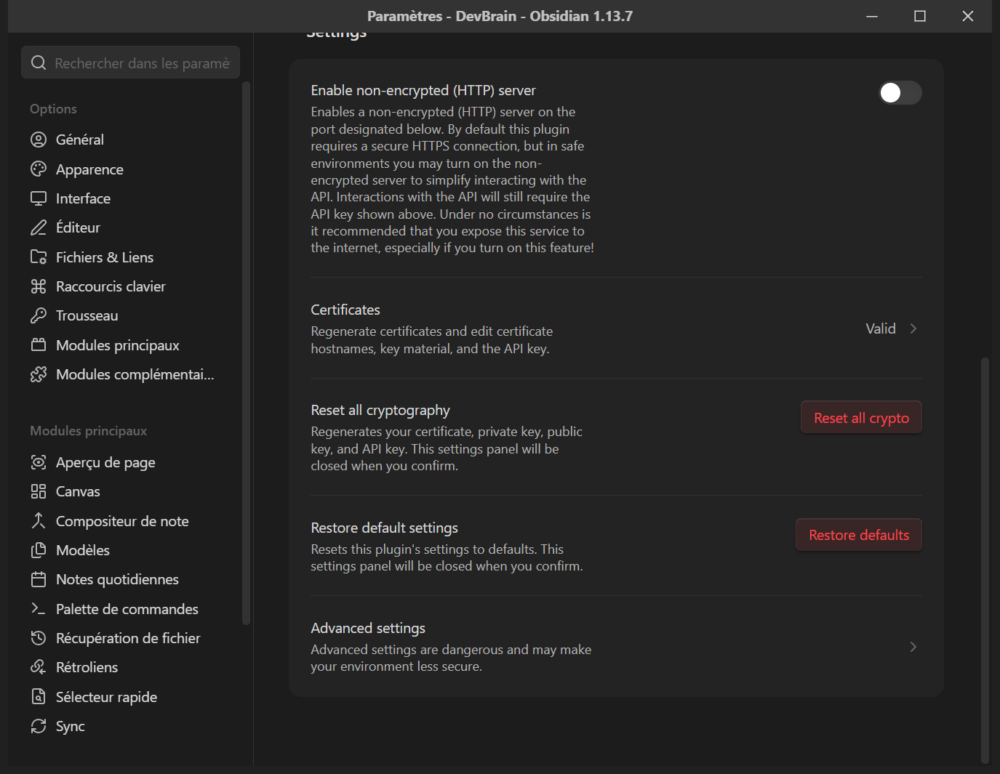

# Dépannage

Chaque entrée est au format **Problème / Cause / Solution**. Les messages cités
sont ceux que le kit imprime réellement.

---

## Le kit ne se lance pas

### `brainkit` : commande introuvable

**Cause** — le kit n'est pas sur le PATH, ou le terminal n'a pas été rouvert
après l'avoir mis.

**Solution** — trois issues, de la plus locale à la plus durable :

```bash
uv run brainkit <sous-commande>              # depuis le depot du kit
export BRAINKIT_RACINE=<racine du depot>     # le resolveur du vault le lit en premier
uv tool install --editable <racine du kit> && uv tool update-shell
```

La troisième exige de **rouvrir le terminal** : un PATH modifié n'atteint pas un
terminal déjà ouvert. Voir [03-installation.md](03-installation.md) §4.

### `BrainKit introuvable`, avec trois pistes imprimées

**Cause** — c'est le résolveur du vault, et il **refuse de deviner**. Les trois
pistes imprimées sont les trois endroits où il a cherché, dans l'ordre : la
variable `BRAINKIT_RACINE`, un kit copié dans l'instance, un dossier `BrainKit/`
voisin.

**Solution** — en choisir une, et la poser durablement.

### `ModuleNotFoundError: yaml`

**Cause** — le kit a été lancé avec un interpréteur Python direct plutôt que par
`uv run`, dans un environnement où PyYAML n'est pas installé.

**Solution** — passer par `uv run`, qui résout la dépendance depuis
`pyproject.toml` ou depuis l'en-tête PEP 723 du script. C'est la seule
dépendance d'exécution du kit.

---

## Une commande refuse

### `manifeste introuvable`

**Cause** — la commande a été lancée hors du vault. Les commandes du kit
résolvent `./brain.yml`, jamais un manifeste voisin : un manifeste ne se devine
pas, c'est ce contre quoi le verdict est rendu.

**Solution** — se placer dans la racine du vault, ou passer `--manifeste`
explicitement.

### `ATTENTION — le vault porte SON manifeste … ce ne sont pas le même brain`

**Cause** — un `--manifeste` a été passé, et ce n'est pas celui du vault.

**Solution** — retirer `--manifeste`. Le kit **obéit** — un ordre est un ordre —
mais il le dit **avant** le verdict, parce que les violations qui suivent
n'auront aucun sens.

### `le manifeste est plus récent que ce kit`

**Cause** — le mineur de `kit.version` ne concorde pas avec le kit installé. Le
refus va **dans les deux sens** : un kit ancien ignorerait en silence des
déclarations qu'il ne sait pas lire, ce qui est pire qu'un refus.

**Solution** — prendre le kit de la génération de l'instance, ou migrer
l'instance.

### le semis refuse la cible

**Cause** — l'un des quatre refus du semis : la cible n'est pas vide, elle vit
sous le dépôt du kit, sous un dépôt git, ou sous un vault. Le message nomme
lequel.

**Solution** — choisir une cible vide et hors de tout dépôt. Ce n'est pas
contournable, et c'est voulu : chacun de ces refus évite une perte.

### `re-seuiller` refuse : arbre de travail sale

**Cause** — c'est une **migration**, par `git mv`. Des déplacements mêlés à des
modifications non committées ne se relisent pas dans un diff.

**Solution** — committer ou mettre de côté le travail en cours, puis relancer.

---

## Le contrôle sort en 2

### `generer` en `--check` sort en 2 alors que rien n'a été touché

**Cause** — deux possibilités seulement : un artefact dérivé a été édité à la
main, ou une régénération a été sautée après une écriture.

**Solution** :

```bash
brainkit generer --ecrire
git add -A && git commit
```

Si l'écart persiste **à l'identique** après régénération, c'est un défaut du
générateur : le signaler avec la sortie complète.

### `generer` signale un écart sur un vault que quelqu'un édite

**Cause** — ce n'est pas une régression. C'est `--check` qui fait son travail
sur un vault dont les zones générées sont en retard sur les pages.

**Solution** — régénérer, ou relancer sur une copie du dernier commit. Deux jeux
d'épreuve lisent un vault réel s'il est là, et sont sujets au même effet.

### `valider` sort une violation **dure** sur un vault fraîchement semé

**Cause** — ce n'est pas un défaut du vault. C'est le mauvais manifeste, ou une
régénération qui n'a pas été faite.

**Solution** — `brainkit generer --ecrire`, puis revalider. Si la violation
tient, relire le manifeste : une instance neuve doit rendre zéro violation dure
**et zéro avertissement**.

---

## Git

### un commit est refusé : l'identité ne concorde pas

**Cause** — c'est le hook `pre-commit`, et il fonctionne. Le message nomme
l'adresse refusée.

**Solution** :

```bash
git config --local user.email "<l adresse attendue>"
git commit --amend --reset-author --no-edit
```

**Le contournement de vérification ne s'utilise pas ici.** Si l'identité locale
manque, la poser ; si elle paraît fausse, **demander** plutôt que la deviner.
Voir [SECURITY.md](SECURITY.md) §2.

### un commit est refusé : trailer de co-auteur

**Cause** — le hook `commit-msg`. Les commits de ce dépôt sont à une seule
personne.

**Solution** — retirer le trailer du message. Un trailer **commenté** passe,
puisque git le retirera de toute façon.

### les hooks ne se déclenchent jamais

**Cause** — `git config core.hooksPath` ne répond rien. Les hooks sont dans le
dépôt, mais git ne regarde pas `.githooks/` par défaut.

**Solution** :

```bash
git config core.hooksPath .githooks
git config core.hooksPath                 # doit repondre .githooks
```

À refaire **après chaque clone** : c'est une config locale, elle ne voyage pas
avec le dépôt. Un **worktree** hérite de celle du dépôt principal ; un clone,
non.

Sous Windows, vérifier en plus que les fichiers de `.githooks/` sont en **LF**
et non en CRLF : un `#!/bin/sh` suivi d'un retour chariot fait chercher un
interpréteur qui n'existe pas. Le `.gitattributes` du dépôt épingle la fin de
ligne pour l'éviter ; si un fichier a été édité hors de git,
`git checkout -- .githooks/` le remet d'aplomb.

---

## Obsidian

### un fichier de vue s'affiche comme du texte brut

**Cause** — la version d'Obsidian est trop ancienne pour le format natif des
vues.

**Solution** — mettre à jour Obsidian (1.10 minimum), ou passer le brain en
profil `nu` et tenir la table à la main.

### Templater n'insère rien

**Cause** — son *Template folder location* n'est pas renseigné, ou pointe
ailleurs que le dossier des gabarits. Le champ est **sensible à la casse**.

**Solution** — [04-obsidian.md](04-obsidian.md) §4.

### une page neuve naît vide, alors que Templater est réglé

**Cause** — la page a été créée par le bouton « nouvelle note » d'Obsidian, qui
n'applique aucun gabarit, et non par un gabarit ou par le skill de capture.

**Solution** — créer la page par le skill de capture, ou par la commande
Templater de création depuis un gabarit.

### un dossier reste visible après « Hide Folder »

**Cause** — l'interrupteur *Hidden File Visibility* de File Hider est actif : le
plugin sait que le dossier doit être masqué, et l'affiche quand même. Ou
l'affichage a besoin d'être rechargé.

**Solution** — vérifier la liste des chemins dans les options du plugin, et
l'interrupteur. Voir [04-obsidian.md](04-obsidian.md) §5.

### l'espace de l'agent apparaît toujours dans la recherche

**Cause** — masquer un dossier de la barre latérale ne le sort **pas** de la
recherche. Ce sont deux réglages distincts.

**Solution** — le filtre d'exclusion, [04-obsidian.md](04-obsidian.md) §6.

### les couleurs du graphe ont disparu

**Cause** — la cible de ces réglages n'est en général **pas versionnée** : elle
ne voyage ni d'un poste à l'autre, ni d'un clone à l'autre.

**Solution** — ré-appliquer la table depuis le manifeste. C'est une étape
d'installation, pas un fichier. Voir [04-obsidian.md](04-obsidian.md) §10.

### un hub spécial a la même couleur que les hubs ordinaires

**Cause** — l'**ordre** des requêtes du graphe. Obsidian applique la première
règle qui correspond, et une règle qui cible un rôle passe avant celle qui cible
un chemin.

**Solution** — remonter les règles de chemin **au-dessus** des règles de rôle.

---

## Le pont avec l'agent

### l'agent ne voit pas le vault

**Cause** — dans l'ordre de probabilité : Obsidian n'est pas lancé sur ce vault
(le serveur ne tourne que pendant ce temps) ; le plugin de pont n'est pas
**activé** ; la clé collée côté agent n'est pas la bonne ; le port est occupé.

**Solution** — vérifier dans cet ordre. Le port par défaut du plugin est visible
dans ses options, avec l'URL locale.

### erreur de certificat, ou échec de la poignée de main TLS

**Cause** — le plugin sert un certificat **auto-signé**. Un client qui n'est pas
configuré pour l'accepter refuse la connexion.

**Solution** — trois issues :

1. télécharger le certificat depuis le lien que le panneau du plugin propose, et
   l'ajouter aux autorités de confiance ;
2. le **régénérer** depuis le panneau — la clé d'API, elle, ne change pas ;
3. en dernier recours seulement, activer le serveur non chiffré du plugin, et
   **uniquement** sur la machine locale.

Les trois se font dans la même section du panneau du plugin :



> Laisser le serveur non chiffré **désactivé** par défaut. Le HTTPS auto-signé
> suffit en local et ne dégrade rien ; le panneau du plugin le dit lui-même en
> toutes lettres.

### la clé a fui

**Cause** — la clé a été committée, collée dans un message, ou laissée visible
dans une capture d'écran.

**Solution** — la régénérer immédiatement depuis le panneau du plugin
(*Reset all crypto*, dans la capture ci-dessus), puis remplacer la valeur
partout où elle avait été collée. Une clé régénérée invalide l'ancienne.
[SECURITY.md](SECURITY.md) §1.

---

## Repartir de zéro

### le vault ne va pas, je veux tout recommencer côté Obsidian

Les réglages d'Obsidian vivent dans `.obsidian/` **à l'intérieur du vault**, et
rien d'autre. Supprimer ce dossier remet l'affichage à neuf sans toucher à une
seule page ni à un seul artefact.

Puis reprendre [04-obsidian.md](04-obsidian.md) au §1.

### le brain lui-même ne va pas

Un manifeste se corrige et un vault se re-sème. Le semis **refuse** d'écrire
dans une cible non vide, donc : semer à côté, comparer, puis décider.

Ce qui ne se refait pas, c'est le **contenu écrit**. Le semis ne le produit pas,
donc il ne le remplace pas non plus.
